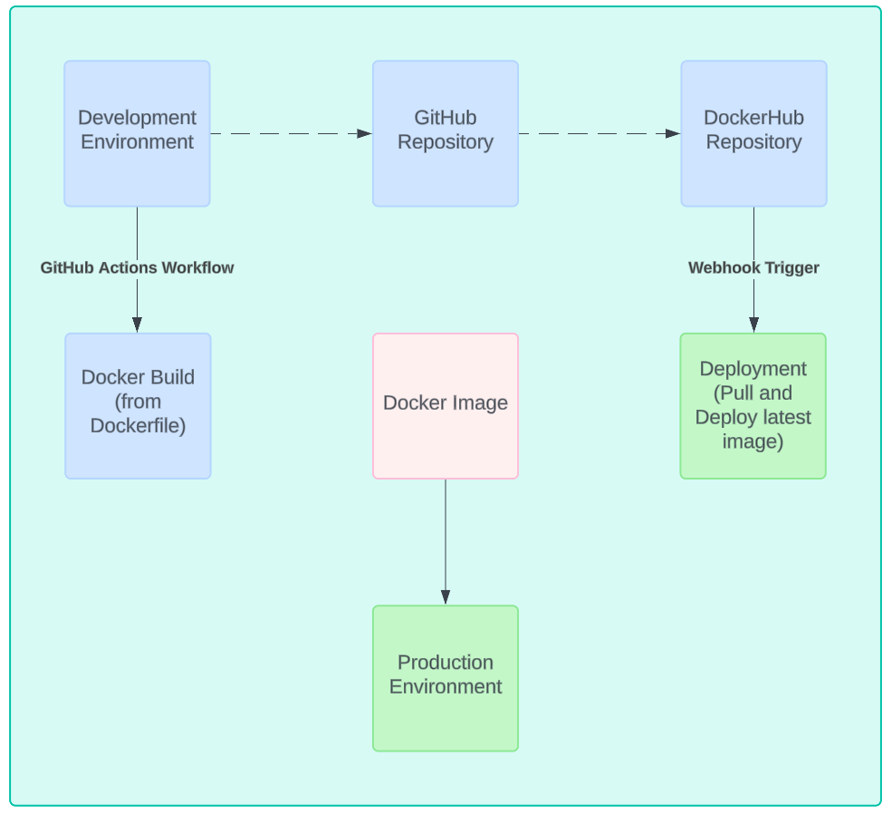

# CD Project Overview

## Overview
This project automates deployment using Git, GitHub, and Docker Hub.

## Continuous Deployment Process Diagram

## How to Install Docker
1. Connect to your EC2 instance.
2. Follow Docker's instructions to install Docker on your Linux instance.

## Container Restart Script
- **Purpose**: Ensures the application runs with the latest changes by pulling the latest Docker image from DockerHub, stopping and removing the existing container, and starting a new container with the updated image.
- **Location**: Place the script in a directory accessible to the user running Docker commands.
- **Add to Repository**: Add the script to your repository under the `deployment` folder.

## Setting Up a Webhook Listener
- **Installation**: Follow adnanh's webhook documentation to install the webhook.
- **Webhook Definition**: Define tasks in a JSON file to execute when specific events are received by the webhook listener.
- **Start the Webhook**: Start the webhook service after installation.

## How to Configure GitHub or DockerHub Webhooks
Configure webhooks in your GitHub repository or DockerHub registry to send messages to the webhook listener on your EC2 instance.

## How to Generate a Git Tag
1. Use `git tag` with the version number (e.g., v1.0.0).
2. Push the tag to GitHub.

## Behavior of GitHub Workflow
When a tag is pushed, GitHub triggers a workflow to build and push Docker images to Docker Hub, following semantic versioning.

## Link to Docker Hub Repository
[Docker Hub repository](https://hub.docker.com/repository/docker/rbuck263/project4-image)

